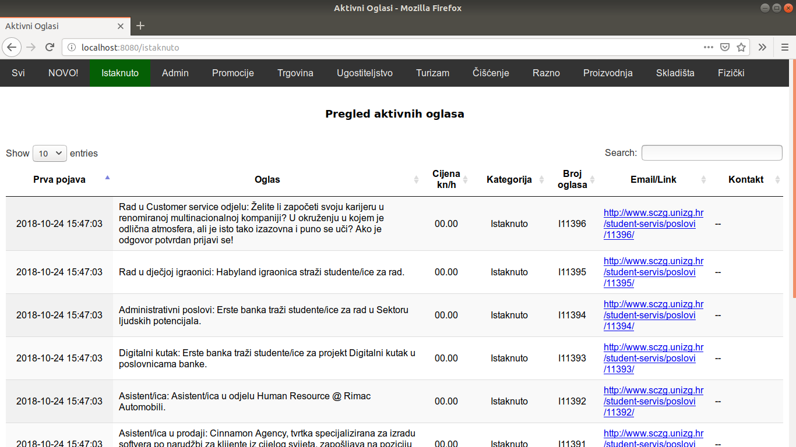

## What is SCTool?
This is a student job hunting tool written in GoLang.

### Why is this useful? 
ScZG add pages do not show job adverts in chronological order nor do they show advert publishing dates.

This little app tracks and archives ads with all relevant info (contact info etc.) which enables the user to see all archived ads, publishing dates, number of times an advert was published etc.
Ads are searchable and all job categories are covered.

#### How it looks


##### CLI powered by Cobra
Build this package (go build or go install). Running:```
sczg --help``` Shows you this message:
```
Usage:
  app [command]

Available Commands:
  fetch       fetch new ad data
  help        Help about any command
  serve       start app server
  setupdb     create database

Flags:
  -h, --help   help for app

Use "app [command] --help" for more information about a command.
```

#### Quick guide
  1. First setup database using the CLI.
  2. Then, start the fetcher service.
  3. Finally, run the webserver in a different terminal.
  4. By default serve runs on port :8080 (visit *localhost:8080/istaknuto*)
  
If you are not a programmer and would simply like to use this and not tinker with it please contact me so I can give you the binaries and get you on your merry way.
